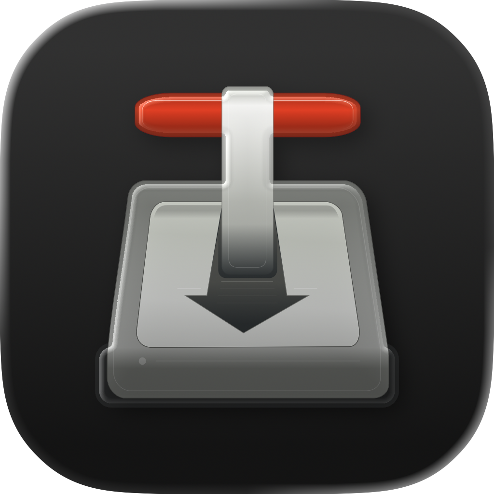
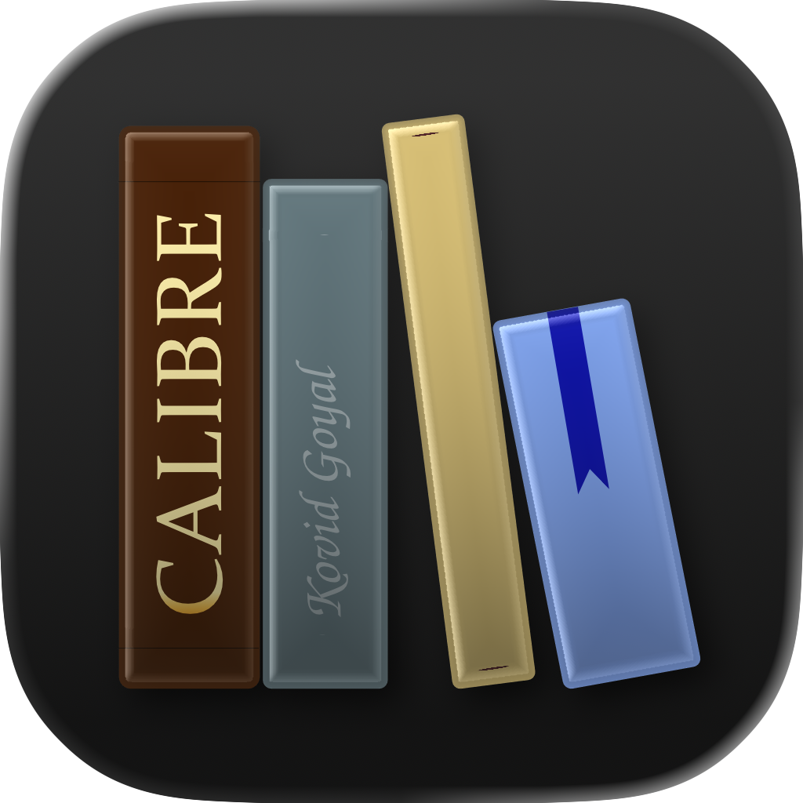
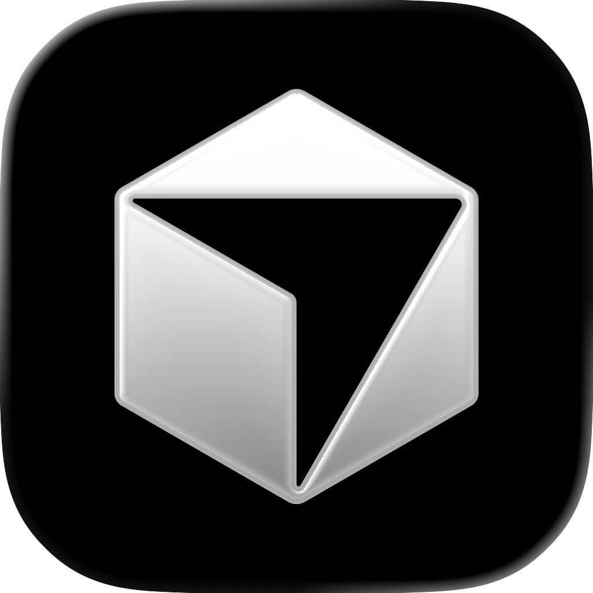
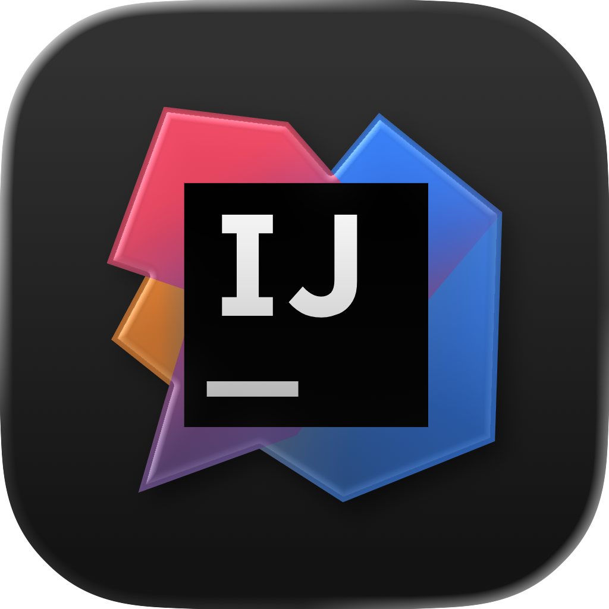
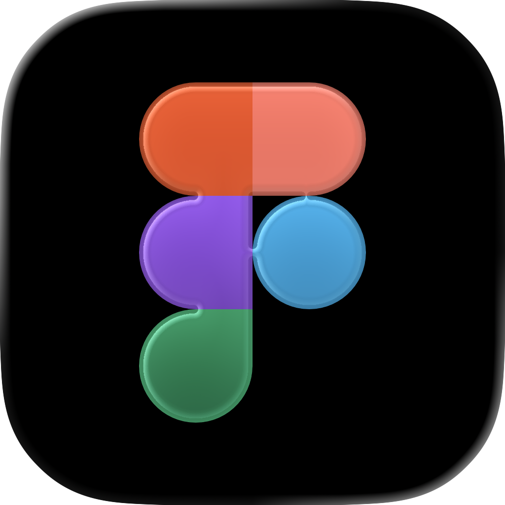

# <samp>OVERVIEW</samp>

Lorem ipsum dolor sit amet, consectetur adipiscing elit. Sed vestibulum iaculis nibh vitae mattis. Nunc nec pretium nisl. Sed accumsan dignissim nisi, mollis facilisis nulla interdum eu. Maecenas diam augue, pulvinar a mattis a, gravida nec ante. Donec convallis nulla et elit consectetur, at egestas ex lobortis. Mauris in aliquam urna. Quisque sit amet libero vel nulla molestie sagittis non a odio. Nulla id nisi ante. In hac habitasse platea dictumst. Phasellus sodales elit quis metus mollis, eu molestie massa imperdiet.

### Network



### Finance


### Office



### Development



### Graphics



### Audio & Video


### Multimedia


### Gaming


### Utility


# <samp>GUIDANCE</samp>

### Generate ICNS Files

```shell
bash src/scripts/create-icns.sh
```
