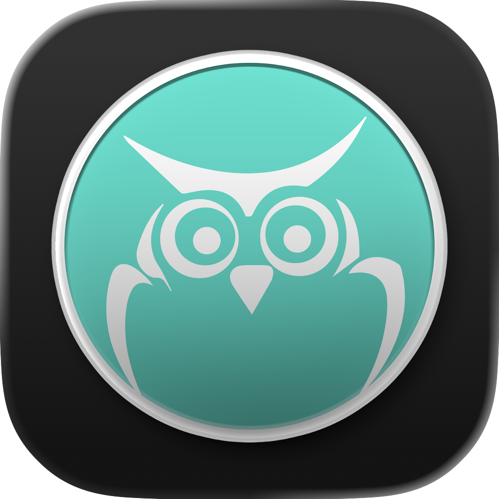
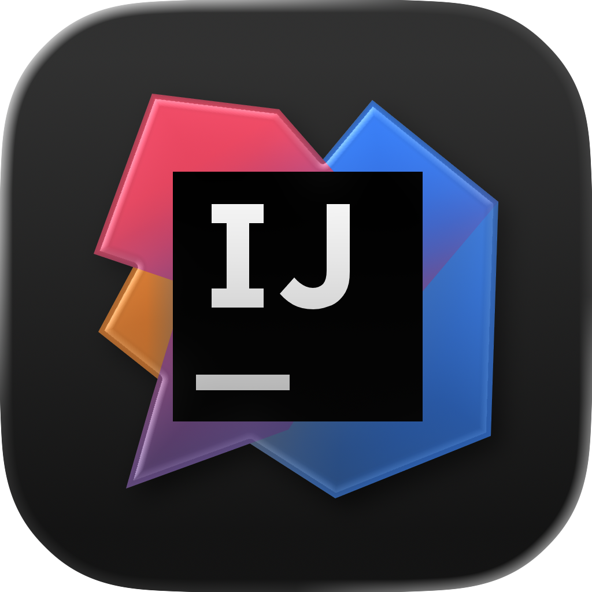

<hr>

# OVERVIEW

Obscuran is a carefully curated icon pack for macOS, created to address the padding issues found in many icon collections. Icons from sources like macOSicons often lack the 10% padding required by macOS Tahoe, leading to display problems. This pack provides properly formatted ICNS files with correct padding, ensuring your custom icons look crisp and professional across all macOS contexts.

<hr>

### Network



<hr>

### Social


<hr>

### Finance


<hr>

### Office


<hr>

### Development



<hr>

### Graphics


<hr>

### Audio & Video


<hr>

### Multimedia


<hr>

### Gaming


<hr>

### Utility


<hr>

# GUIDANCE

### Create All ICNS Files

```shell
bash src/scripts/create-icns.sh
```

<hr>

### Delete All DS_Store Files

```shell
find ~ -name ".DS_Store" -delete
```

<hr>
