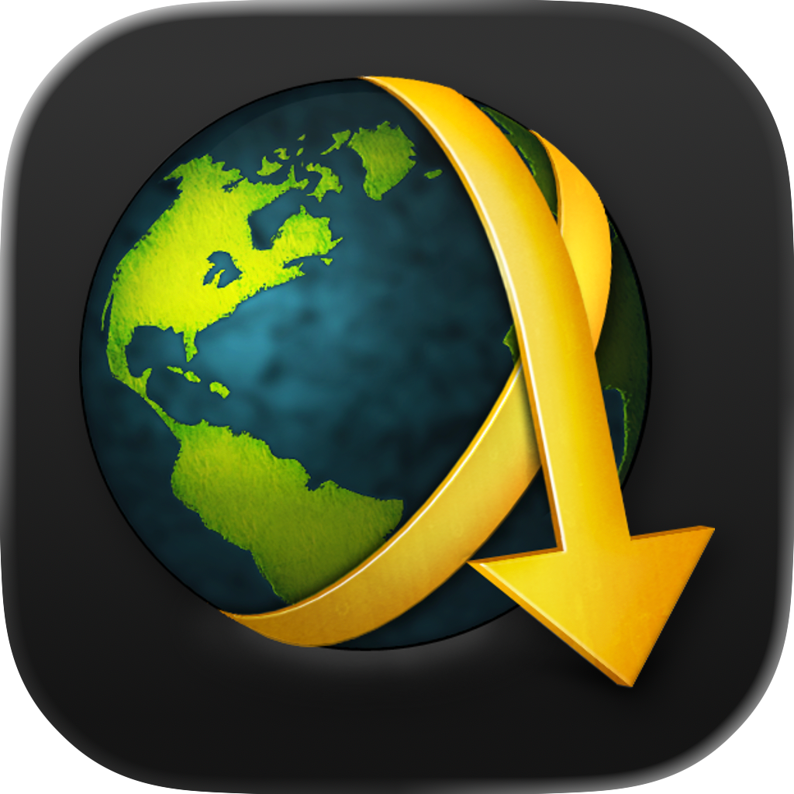
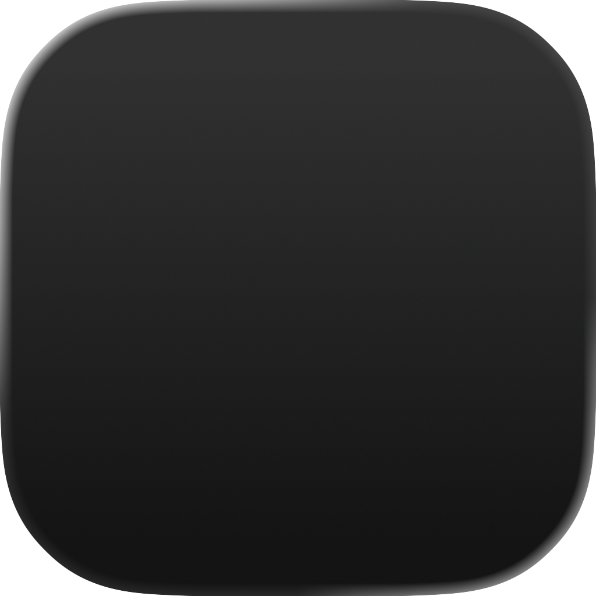
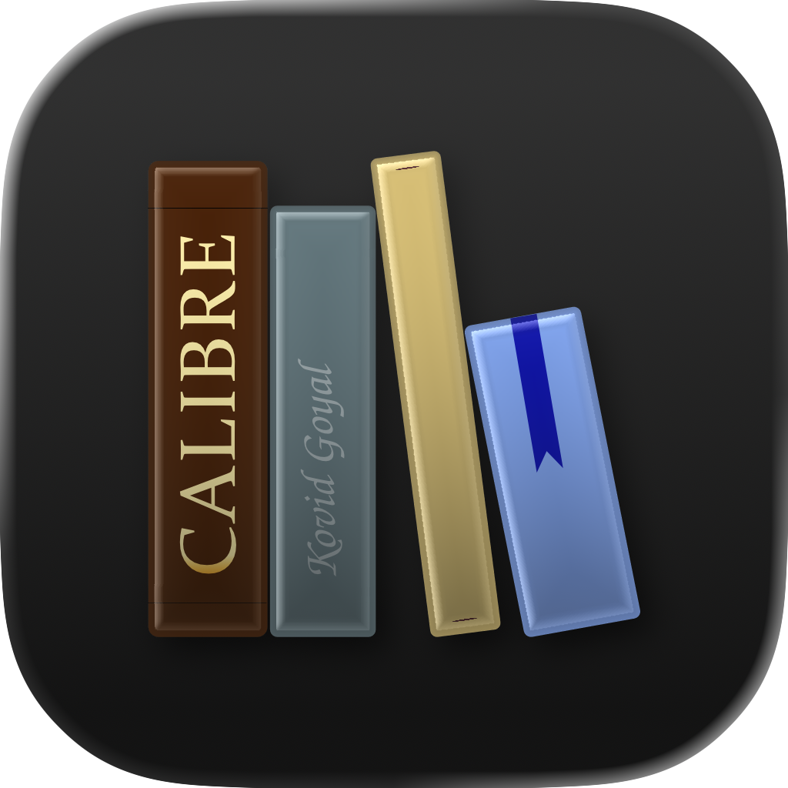
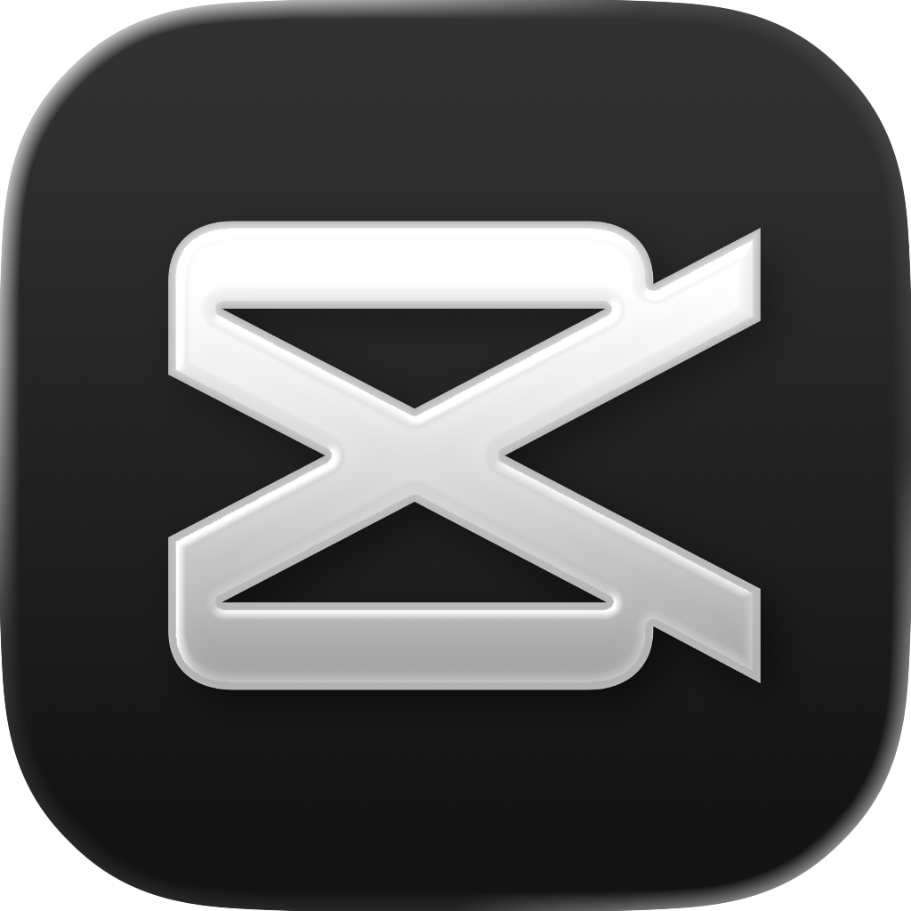

<hr>

# OVERVIEW

Obscuran is a carefully curated icon pack for macOS, created to address the padding issues found in many icon collections. Icons from sources like macOSicons often lack the 10% padding required by macOS, leading to display problems. This pack provides properly formatted ICNS files with correct padding, ensuring your custom icons look crisp and professional across all macOS contexts.

### Network



### Social


### Finance


### Office



### Development


### Graphics


### Audio & Video



### Multimedia


### Gaming


### Utility


<hr>

# GUIDANCE

### Create All ICNS Files

```shell
bash src/scripts/create-icns.sh
```

### Delete All DS_Store Files

```shell
find ~ -name ".DS_Store" -delete
```

<hr>
